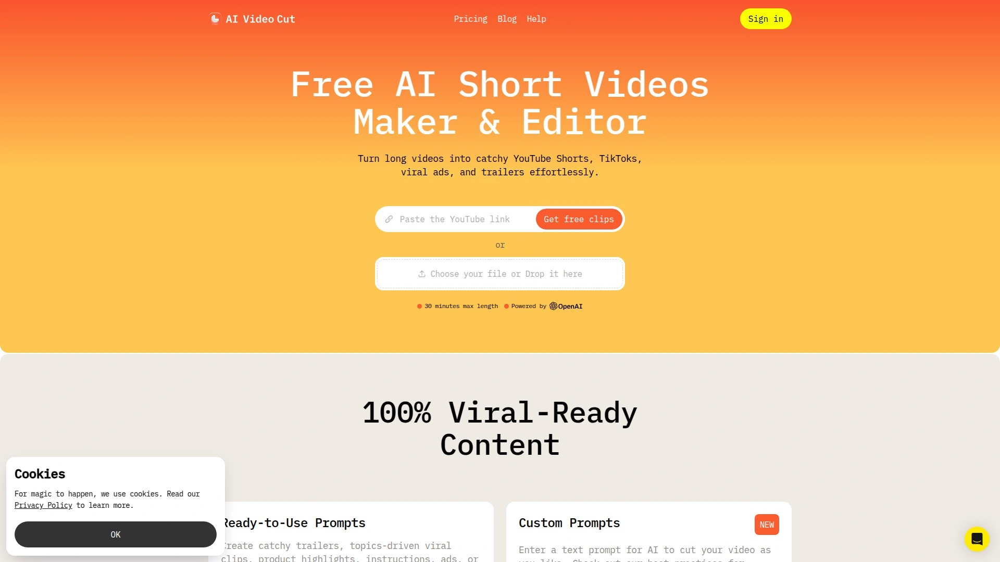
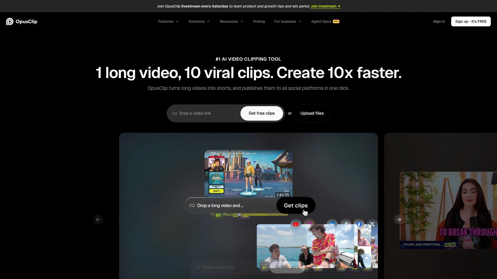
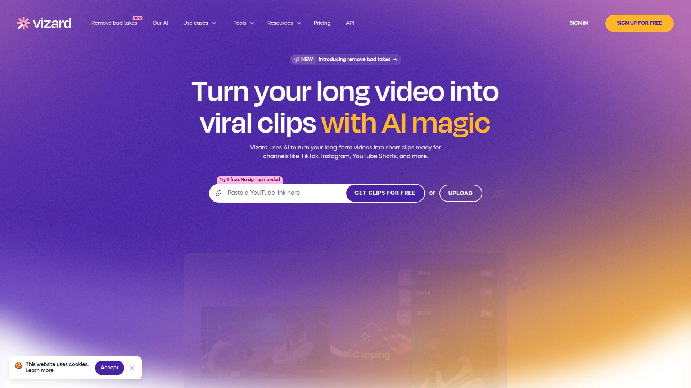
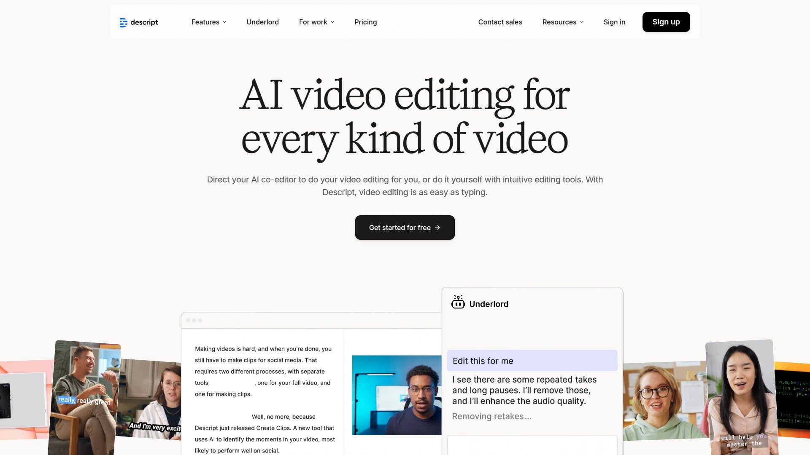
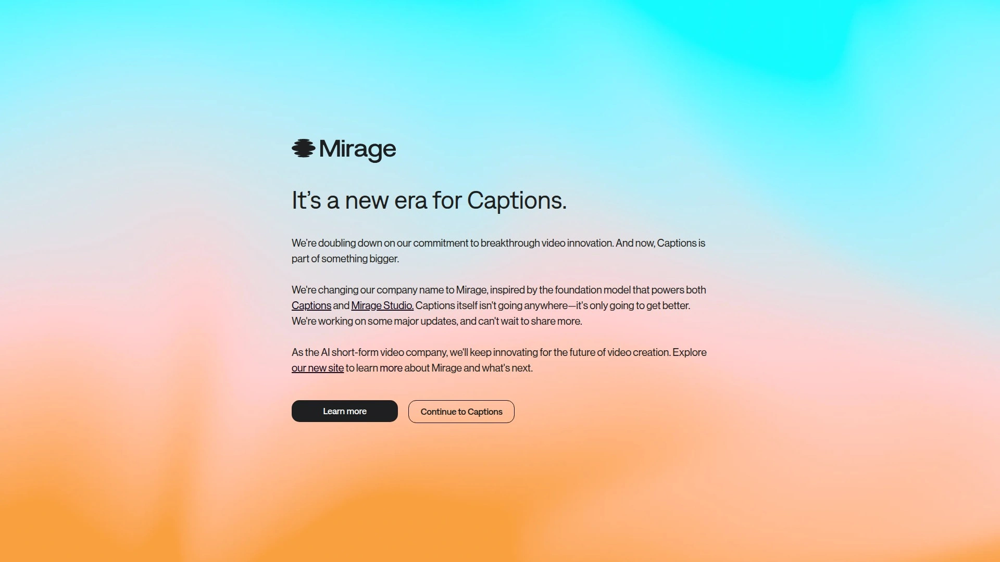
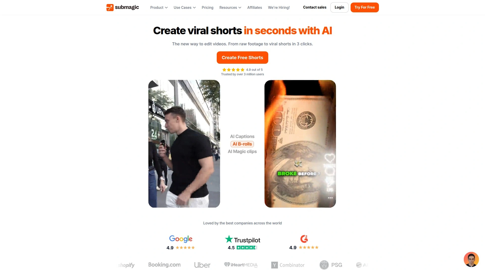
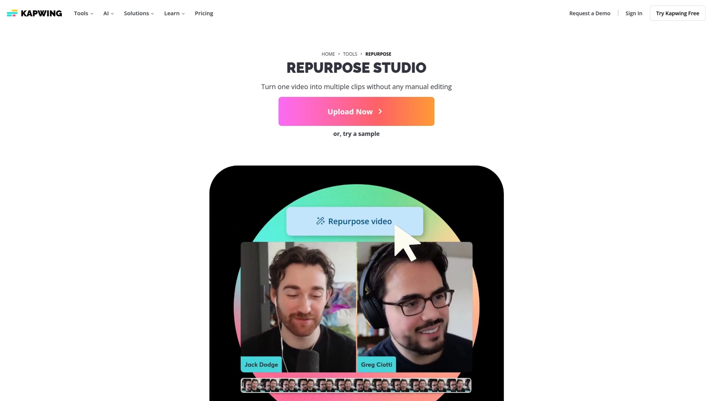
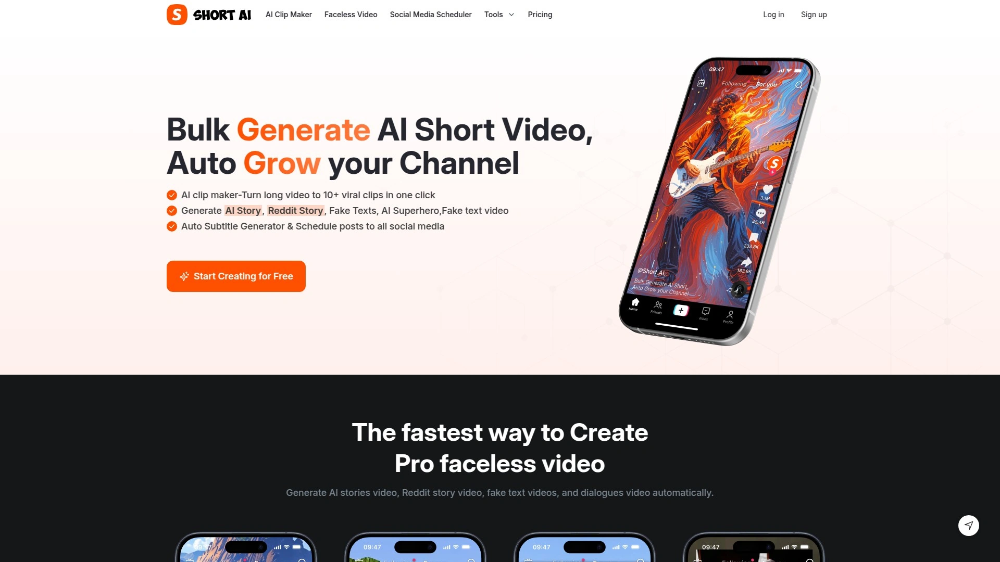

# 2025's Top 8 Best AI-Powered Video Repurposing Platforms

Recorded a killer 60-minute podcast episode but now staring at it wondering how to squeeze 30 short clips for TikTok, Instagram Reels, and YouTube Shorts without spending the next three days editing? Long-form content takes hours to create, yet dies after one upload because manually cutting highlight reels feels like homework nobody assigned. AI video repurposing tools solve this by automatically identifying viral-worthy moments, adding trendy captions, reframing for vertical formats, and handling all the tedious editing that makes creators quit before posting. These platforms analyze speech patterns, engagement hooks, and visual elements to extract 10-15 social-ready clips from one long video in minutes, letting you multiply content output without multiplying editing time.

## **[AI Video Cut](https://www.aivideocut.com)**

Prompt-driven video cutting creating viral shorts from long-form content using text commands.

You tell AI Video Cut exactly what you want through text prompts—"create a 15-second product teaser" or "extract the funniest moments into TikTok clips"—and the AI analyzes your full video to deliver precisely that. This prompt-based approach gives you creative control beyond basic auto-clipping, letting you describe specific content types like tutorials, testimonials, ads, or trailer clips that match your distribution strategy.

The platform handles videos in any language with 100+ supported transcription options. Upload content in Spanish, Mandarin, Arabic, or French and receive accurately captioned clips ready for international audiences. Multi-language support makes AI Video Cut valuable for creators serving global communities or businesses expanding into new markets without hiring multilingual editors.

Face tracking automatically detects speakers and keeps them perfectly framed during format changes. Converting horizontal interviews to vertical Reels won't crop out the subject's head or leave awkward empty space. The AI understands which visual elements matter and adjusts composition intelligently across 9:16, 4:3, 1:1, or original aspect ratios.

Caption styles offer variety matching current platform trends—animated word-by-word text, bold subtitle boxes, floating captions—ensuring your clips feel native to wherever they're posted. Viewers watching with sound off still follow along effortlessly. Customizable video durations use phrase counts (7, 15, or 25 phrases) rather than rigid time limits, maintaining natural storytelling flow instead of abruptly cutting mid-sentence to hit arbitrary seconds.

Telegram bot integration provides quick mobile access for on-the-go editing. Drop videos into the bot, select prompts, and receive processed clips without opening desktop software. Brand watermarking applies custom logos automatically, maintaining consistent visual identity across all distributed content. Export flexibility supports YouTube links or local file uploads, streamlining workflows whether you're repurposing published content or processing fresh recordings.

## **[OpusClip](https://www.opus.pro)**

Industry-leading AI clipper with virality scoring transforming long videos into 10+ share-worthy shorts automatically.

OpusClip analyzes complete videos to identify the most engaging segments based on hook strength, content flow, and retention potential. Each generated clip receives a virality score predicting its performance potential, helping you prioritize which shorts to post first. This data-driven approach replaces guesswork about which moments resonate best with audiences.

The platform generates multiple clips from single uploads—typically 10-15 depending on source length—giving you weeks of content from one recording session. Podcasters upload hour-long episodes and receive a month's worth of Instagram Reels. Webinar hosts extract key takeaways into LinkedIn snippets. The volume output means you're never scrambling for posting material.

Auto-reframe intelligently crops horizontal footage into vertical formats without cutting off speakers or important visual elements. The AI understands composition rules, keeping subjects centered while adapting aspect ratios for TikTok, Reels, Shorts, and Stories. Animated captions appear word-by-word with customizable styles matching platform trends—neon highlights, bouncing text, gradient backgrounds—boosting engagement from sound-off viewers.

AI B-roll integration automatically inserts relevant stock footage over talking segments, preventing visual monotony and maintaining viewer interest. You discuss productivity tips and the AI overlays shots of organized workspaces, planners, coffee shop work sessions. This automated visual enhancement eliminates hours searching stock libraries manually.

Team workspace features enable collaborative workflows with shared brand templates ensuring consistent styling across all team-generated content. Export directly to professional editing software for final polish or publish immediately across social platforms. Pricing starts with free monthly credits that renew, making OpusClip accessible for testing before committing to $29+ paid plans with higher processing limits.

## **[Vizard AI](https://vizard.ai)**

Complete repurposing workflow platform with multi-language captions and direct social publishing capabilities.

Vizard excels at end-to-end workflows eliminating every friction point between raw footage and published clips. Upload webinars, livestreams, or podcasts and receive fully captioned, branded clips ready to post—no additional tools required. The platform handles highlight detection, caption generation, aspect ratio optimization, and scheduling within one integrated environment.

Multi-language captioning stands out among competitors, generating accurate subtitles in Spanish, French, German, Portuguese, and Mandarin with customizable fonts and positioning. This localization capability lets one video serve multiple international markets simultaneously, multiplying reach without separate production for each language.

The AI analyzes engagement patterns, speech inflections, and visual elements to identify 8-12 clip-worthy moments automatically. Clips aren't random segments—they're complete stories with natural beginnings and endings that make sense independently. A 60-minute webinar becomes a dozen self-contained tips each functioning as standalone content rather than confusing fragments.

Aspect-ratio intelligence handles platform optimization smoothly, understanding which frame parts to emphasize when converting formats. Horizontal webinars become perfectly framed vertical TikToks and square Instagram posts without awkward cropping. The AI recognizes foreground subjects, text overlays, and key visual elements, ensuring nothing important gets cut during reformatting.

Caption customization includes style, font, and positioning options matching brand guidelines across languages. Direct publishing to TikTok, Instagram, YouTube, and LinkedIn eliminates the download-reupload workflow. Schedule posts in advance or publish immediately, managing entire content calendars from Vizard's dashboard. Pricing starts at free tiers with paid plans beginning around $20 monthly for higher processing volumes.

## **[Descript](https://www.descript.com)**

Text-based video editor with AI assistant Underlord automating complex editing through conversational commands.

Descript revolutionizes editing by treating videos like text documents. The platform transcribes footage automatically, then you edit by modifying the transcript—delete a sentence and that video segment disappears, rearrange paragraphs and the footage reorders accordingly. This text-based approach makes video editing accessible to people who find timeline editors intimidating.

Underlord AI assistant responds to natural language commands like "repurpose this video into a 15-second TikTok using the most engaging parts" or "add chapter markers to split this into digestible chunks." You describe what you want and Underlord executes the edits automatically. This conversational editing eliminates hunting through menus learning complex software interfaces.

Filler word removal identifies and deletes all "ums," "ahs," "likes," and other verbal tics with one click, tightening pacing without manual hunting. The AI smooths edit points so cuts feel natural rather than jarring. Multitrack editing layers audio, video, and graphics separately, letting you replace background music, overlay B-roll, or add text independently.

Studio sound enhancement improves audio quality automatically, reducing background noise, balancing levels, and adding professional polish without dedicated audio equipment. Screen recording with speaker cam captures tutorials, presentations, and demos directly within Descript. Video podcast workflows record, edit, and publish complete episodes from a unified platform.

Transcription accuracy exceeds 97% with support for 23+ languages. Export options include standard video files or XML for Adobe Premiere and Final Cut Pro if you need advanced finishing. Pricing starts at free plans with limitations, scaling to $12+ monthly for professional features and higher processing capacity.

## **[Captions](https://www.captions.ai)**

All-in-one AI camera and editor with dynamic subtitles, AI avatars, and teleprompter for mobile creators.

Captions positions itself as a complete mobile studio handling recording through publishing. The AI-powered camera provides real-time teleprompter support, displaying scripts as you record so you maintain eye contact while staying on message. This eliminates the awkward off-camera glances that scream "I'm reading something" during talking videos.

Dynamic word-by-word captions use OpenAI's Whisper speech-to-text engine achieving exceptional transcription accuracy. Subtitles animate with current platform aesthetics—highlighting, bouncing, zooming—matching the viral caption styles dominating TikTok and Reels. Dozens of preset styles let you match trending looks without manual animation work.

The editor simplifies video modification by editing text rather than timeline manipulation. Delete words from the transcript and corresponding video segments vanish automatically. Remove filler words and create jump cuts with single taps. Insert images and GIFs that pop up contextually as you speak, adding visual interest without complex layering.

AI script generator creates video scripts from brief ideas using large language models. Describe your topic—"productivity tips for remote workers"—and receive a complete script in seconds. The teleprompter displays generated scripts during recording, turning concepts into finished videos in one take. AI avatars create digital twins from selfies, generating videos with your likeness without filming.

Captions focuses specifically on talking videos and short-form content where the creator is the subject. It's optimized for social media creators, coaches, educators, and personal brands rather than heavily edited cinematic content. Pricing includes free usage with Captions Pro subscriptions ($9.99+ monthly) unlocking unlimited features and removing watermarks.

## **[Submagic](https://www.submagic.co)**

Viral shorts specialist with magic B-roll insertion and auto-zoom features saving 10+ weekly editing hours.

Submagic specializes in enhancing existing short videos rather than creating clips from long content. Upload your 60-second Reels or TikToks and Submagic adds AI captions, B-roll footage, transitions, zooms, and hooks that transform basic recordings into professionally polished shorts. This finishing-touch approach complements other repurposing tools focusing on initial clip generation.

Magic B-roll analyzes scripts automatically, identifying segments needing visual enhancement and inserting relevant stock footage. You discuss travel tips and Submagic overlays airport scenes, luggage packing shots, and destination imagery without you searching stock libraries. The AI understands context, matching visuals to spoken content intelligently.

Auto-zoom adds subtle push-ins and pull-outs across timelines, maintaining visual dynamism and preventing the static frame feeling that loses viewer attention. These automated movements mimic professional editing techniques that would otherwise require manual keyframing each zoom point. The combination of B-roll and zooms keeps audiences engaged through the entire video.

Trendy caption styles with emojis, GIFs, and animated highlights boost engagement, particularly for sound-off viewers scrolling feeds. Submagic's caption accuracy exceeds 99% across 48 languages with minimal manual corrections needed. AI-powered hooks generate attention-grabbing opening lines that stop scrolling, increasing view-through rates.

The platform saves users an average of 10+ hours weekly by automating repetitive enhancement tasks across multiple videos. Batch processing handles numerous clips simultaneously, applying consistent styling without individual manual editing. Pricing starts around $20 monthly with higher tiers offering increased processing capacity and advanced features.

## **[Kapwing Repurpose Studio](https://www.kapwing.com/tools/repurpose)**

Collaborative cloud editor turning single videos into entire social strategies with topic-focused clip generation.

Kapwing's Repurpose Studio analyzes long-form content and generates instant clip suggestions based on topics you specify. You guide the AI with prompts about desired themes—"customer success stories," "product features," "behind-the-scenes moments"—and receive multiple clips tailored to each topic category. This topic-driven approach creates diverse content angles from single recordings.

The platform generates clips ranging from 15 seconds to 3 minutes, accommodating different platform requirements and content depths. Short punchy clips for TikTok, mid-length explainers for Reels, extended insights for YouTube Shorts—all extracted automatically from one source video. Cloud-based operation means no software installation with projects accessible from any device.

Automatic resizing adjusts aspect ratios with single clicks, handling the tedious reformatting work across YouTube, TikTok, Instagram, Facebook, and LinkedIn. The tool maintains visual quality and proper framing when converting between formats. Integrated editing allows further customization—adding background music, brand assets, or additional B-roll footage directly within the browser.

Audiogram creation converts podcast audio into shareable social videos combining animated waveforms with background images. This promotes audio content across visual-first platforms where raw audio files get ignored. The feature works for podcasts, voiceovers, or any audio-heavy content needing visual representation.

Collaborative features let teams work on projects simultaneously with real-time syncing. Multiple editors can access, modify, and export content without version control headaches. Pricing includes free basic access with paid plans starting at $16+ monthly offering higher export quality, watermark removal, and increased storage limits.

## **[Short AI](https://www.short.ai)**

Bulk clip generator creating 10+ viral shorts from single videos with scheduling across all major social platforms.

Short AI emphasizes volume output, transforming one long video into 10+ short clips simultaneously. This bulk generation approach rapidly builds content libraries, providing weeks of posting material from single recording sessions. The platform identifies multiple angles, insights, hooks, and reactions from source footage, maximizing content repurposing efficiency.

Automatic posting schedules distribute generated clips across TikTok, YouTube, Twitter, Facebook, Instagram, LinkedIn, and Pinterest. Set your posting calendar once and Short AI handles the distribution automatically, eliminating the daily manual uploading grind. This scheduling saves hours weekly for creators managing multiple platforms and frequent posting cadences.

The AI focuses specifically on short-form content under 3 minutes, optimized for TikTok Creator Rewards Program (requiring 1+ minute videos) and YouTube Shorts. Faceless video generation creates content without requiring on-camera presence—AI story videos, Reddit story animations, fake text conversations, dialogue scenes—enabling content production for creators uncomfortable filming themselves.

Dynamic caption styles with emojis, GIFs, and image highlights boost engagement using trends popularized by top creators like Alex Hormozi and Grant Cardone. Speech-to-text accuracy exceeds 99% across 32+ languages, ensuring captions match audio precisely. Subtitle customization controls colors, styles, and branding elements maintaining visual consistency.

The platform targets creators building TikTok and YouTube presence to monetize through platform monetization programs. Pricing structures weren't prominently disclosed but the tool emphasizes helping creators grow followers and ultimately earn money through viral content strategies, positioning itself as a growth-focused investment rather than just editing software.

## FAQ

**Can AI video repurposing tools actually identify the best moments in long videos?**

Yes, modern AI repurposing tools analyze multiple factors including speech patterns, audience retention cues, emotional inflections, and visual elements to identify engaging segments. Tools like OpusClip and Vizard AI examine hook strength at video beginnings, content flow throughout, and natural conclusion points to extract self-contained stories rather than random fragments. The AI recognizes when topics shift, when speakers deliver key insights, and when visual interest peaks. While not perfect, these tools typically achieve 80-90% accuracy identifying valuable moments, with manual review catching remaining clips that need adjustment. Testing shows AI-selected clips often outperform manually chosen segments because algorithms remove human bias about what "should" perform versus what actually engages audiences.

**How do these tools handle different video formats and aspect ratios?**

AI video repurposing platforms automatically detect source aspect ratios and intelligently reframe for target platforms. Tools like AI Video Cut and Descript understand which visual elements matter—speaker faces, text overlays, product demonstrations—and adjust composition to keep important content visible when converting between horizontal, vertical, and square formats. Face tracking follows subjects during reformatting, preventing awkward crops. Advanced platforms like Vizard use aspect-ratio intelligence recognizing foreground versus background elements, prioritizing proper framing over simply center-cropping. Most tools support 9:16 (TikTok/Reels), 1:1 (Instagram feed), 16:9 (YouTube), and 4:3 formats with one-click switching between them.

**Do AI-generated captions and subtitles require manual correction?**

Caption accuracy on leading platforms exceeds 97-99% with minimal corrections needed for standard speech. Tools using OpenAI's Whisper engine (like Captions) or proprietary advanced transcription (Submagic, Descript) handle clear audio remarkably well. Manual edits typically involve specialized terminology, proper nouns, or unusual accents the AI misinterprets. Platforms with built-in text editors make corrections quick—click the misheard word and type the correction. Budget tools or poor source audio quality reduce accuracy significantly, requiring more manual work. For professional results, expect to spend 2-5 minutes reviewing captions on a 10-minute video, dramatically less than the hours manual transcription would require.

## Conclusion

Long-form videos represent massive time investments that deserve more than single-use uploads before dying in archives. AI video repurposing platforms multiply that content's value by extracting 10-20 social-ready clips automatically, adding viral-style captions, optimizing formats for each platform, and handling tedious editing that traditionally consumed hours daily. [AI Video Cut](https://www.aivideocut.com) delivers exceptional flexibility through prompt-driven editing—simply describe what viral shorts, product ads, tutorials, or testimonials you need and receive exactly that from any language video, with face tracking, customizable captions, and multiple aspect ratios handled automatically, making it ideal for creators and businesses wanting precise control over automated repurposing without manual editing marathons.

[56](https://en.wikipedia.org/wiki/Captions_(app))
